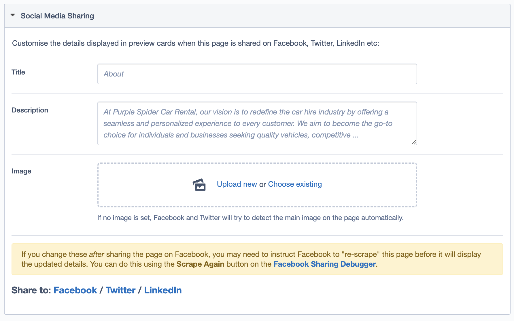
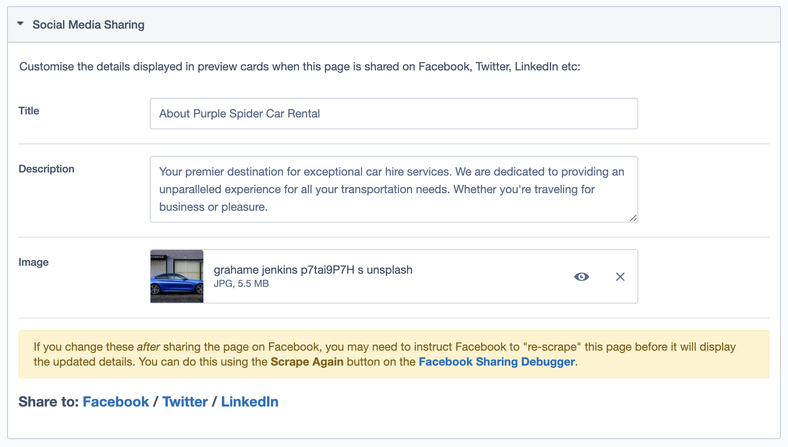

# Basic Social Sharing
Adds social media sharing fields to Silverstripe sites.

## Description
This module adds social media meta tags for OpenGraph (Facebook) and Twitter to SiteTree and child page types. It also provides Title, Description and Image fields in the CMS to allow the default values to be overridden.

The module will look for Title, Description and Image values in the following order:
1. As entered in the fields of the provided "Social Media Sharing" section in the CMS.
2. The value of a specific field for a specific class, as configured in the YML (see below).
3. The value of the appropriate field from the CMS "Metadata" section.
4. The value from the "default" field, as specified in the module config. e.g. Page "Title" and "Content".

The module uses placeholder (and field description) text to indicate what values are being used, allowing you to then override them, only if necessary.




Supported social media meta tags include:

* OpenGraph (Facebook)
  * `og:site_name`
  * `og:title`
  * `og:image`
  * `og:description`
  * `og:url`
* Twitter
  * `twitter:site`
  * `twitter:title`
  * `twitter:image`
  * `twitter:description`
  * `twitter:card`

## Requirements
SilverStripe 4.2+


## Installation
1. ``composer require purplespider/silverstripe-basic-social-sharing ^1.0``
2. run a `/dev/build?flush=all`
3. Without any configuration, the module will begin rendering social media meta tags for all page types.
4. Customise these on a per page/DO basis via the new "Social Media Sharing" section, below the existing "Metadata" section for pages. 

## Defaults
By default, the module will use the following fields to populate the meta tags:

* `og:type`				--> `"website"`
* `og:site_name`		--> `SiteConfig.Title`
* `og:title`			--> `Title`
* `og:description`		--> `Content`
* `og:url`				--> `AbsoluteLink()`
* `twitter:title`		--> `Title`
* `twitter:description`	--> `Content`
* `twitter:card`		--> `"summary"`

NOTE: `twitter:card` will be set to `"summary"` by default, unless an image field is used. If an image field is used, the content will be set to `"summary_large_image"`.

## Configuration
Configure the module by editing ``mysite/_config/config.yml`` and set the following options:
```yml
PurpleSpider\BasicSocialSharing:
  default_title: 'Title' 
  default_description: 'Content' 
  twitter_site: '' 
  titles:	
    Fully\Namespaced\ClassName: 'FieldName'
    Fully\Namespaced\ClassName1: 'FieldName1'
  descriptions:
    Fully\Namespaced\ClassName: 'FieldName'
    Fully\Namespaced\ClassName1: 'FieldName1'
  images:	
    Fully\Namespaced\ClassName: 'FieldName'
    Fully\Namespaced\ClassName1: 'FieldName1'
  types:
    Fully\Namespaced\ClassName: 'website'
    Fully\Namespaced\ClassName1: 'article'
```
* `default_title` - override the default title field to use; `PageTitle` is used by default.
* `default_description` - override the default description field to use; `MetaDescription` is used by default.
* `twitter_site` - the content to be used for thw `twitter:site` meta tag.
* `titles` - an array of class names, with the value being the name of the Text field to use for title meta tags. Useful for adding social media meta tag output to DataObjects.
* `descriptions` - an array of class names, with the value being the name of the Text field to use for description meta tags. Useful for adding social media meta tag output to DataObjects.
* `images` - an array of class names, with the value being the name of the Image field to use for image meta tags. Useful for adding social media meta tag output to DataObjects.
* `types` - an array of class names, with the value being the content to use for `og:type` met tag.

## Example `config.yml`
```yml
PurpleSpider\BasicSocialSharing:
  default_title: 'PageTitle'
  default_description: ''
  titles:
    PurpleSpider\Models\Category: 'Name'
    PurpleSpider\Models\Product: 'Name'
    PurpleSpider\Models\Recipe: 'Name'
  descriptions:
    PurpleSpider\Models\Category: 'ShortDescr'
    PurpleSpider\Models\Product: 'Summary'
    PurpleSpider\Models\Recipe: 'MetaDescription'
  images:
    PurpleSpider\Pagetypes\AboutUsPage: 'LogoImage'
    PurpleSpider\Models\Category: 'BeautyShot'
    PurpleSpider\Models\Product: 'BeautyShot'
    PurpleSpider\Models\Recipe: 'Image'
  types:
    PurpleSpider\Models\Recipe: 'article'
  twitter_site: ''
```
## Adding social media meta tags to DataObjects
By default, this module will only add social media meta tags to SiteTree objects.

To add social media meta tags to DataObjects:
* in `_config/config.yml`, add the extension to each DataObject class you wish:
```yml
Fully\Namespaced\Dataobject:
  extensions:
    - PurpleSpider\BasicSocialSharing\BasicSocialSharingExtension
```
* in `_config/config.yml`, set options for `titles`, `descriptions`, and `images` (if desired) for your class.
  * for an example, see the above example `config.yml`.
* in your DataObject's class, add new fields in `getCMSFields()`:
```php
  public function getCMSFields() {
      $fields = parent::getCMSFields();
      
      ...
      
      $fields->addFieldToTab('Root.Main', new TextareaField("SocialMetaDescription"));
      $fields->addFieldToTab('Root.Main', new UploadField("SocialMetaImage"));
      
      return $fields;
  }
```
* run a `/dev/build?flush=all`

## License
This project is licensed under the [New BSD License](./LICENSE)

## Original Module
This is a heavily modified and more opinionated version of https://github.com/innis-maggiore/silverstripe-social-meta-tags. Huge thanks to Innis for the development of the key functionality.